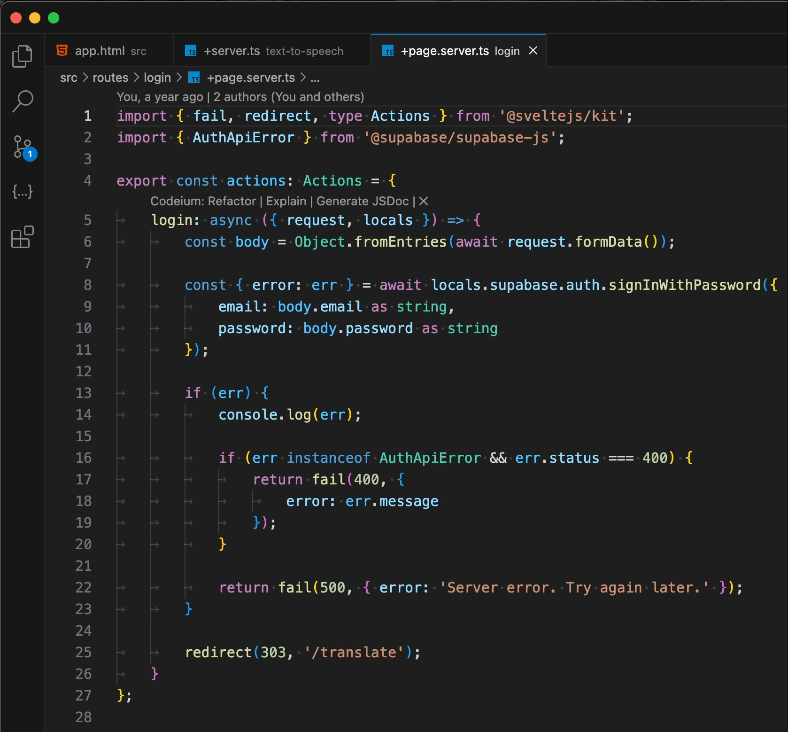
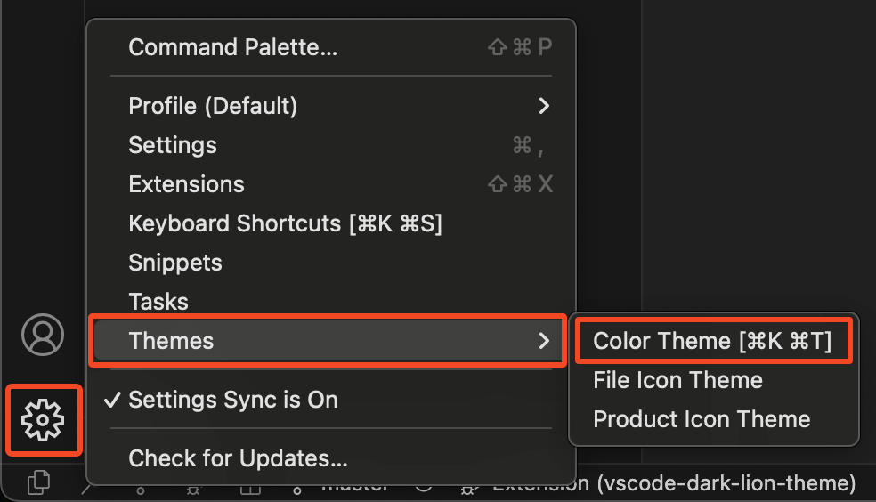
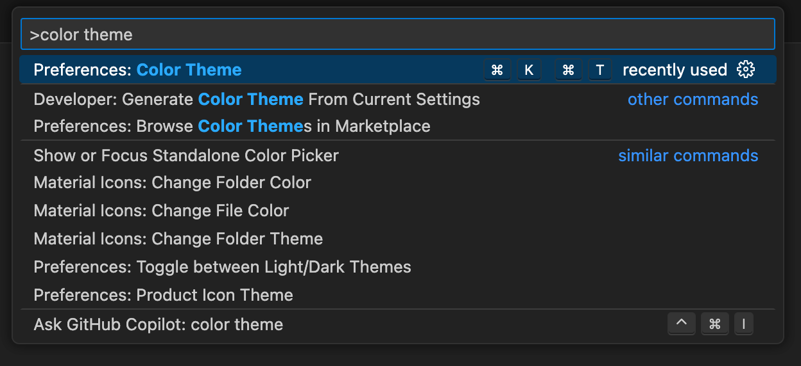

# Dark Lion Theme

This is a dark and semantically rich theme based on the Tailwind color palette and the default Dark Modern theme.

### Semantic Emphasis

Brings more attention to important tokens such as  functions and  string literals.

Differentiates in color between:

-  variables and  properties (`err` vs. `error`)
-  keywords and  storage types (`async` vs. `const`)
-  variables and  constants (`request` vs. `body`)

_Comparison with the default Dark Modern theme._

## How to Change Your Theme

You can change you theme by navigating to this menu in the bottom left corner:

Alternatively, by opening the Command Palette by pressing `Cmd + Shift + P` and searching for `Color Theme`:

